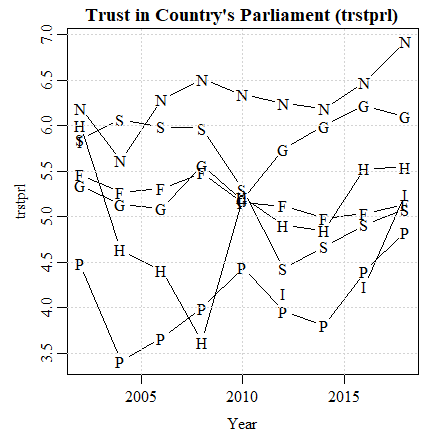
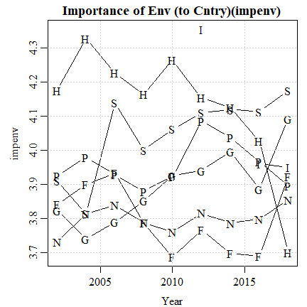

# TRESCA: Brief Analysis on ESS and Eurobarometer Data
Jay Lee  
Last update: October 23, 2020 (15:14)

Test

_I recommend you read the HTML version of this document in a web browser._

For this preliminary analysis, I looked into the _European Social Survey_ (**ESS**) and the _Eurobarometer_ (**EB**). 
* **[Click here to download](http://bit.ly/tresca_ess_eb)** the ZIP file (200KB) containing the outputs discussed in this README document.
* In order to understand some qualities of the public, in relation to some of TRESCA's topics (including MOOC and experimental video), I focused on - for now - questions (aka items) that pertain to _environment/climate change_, _trust_, and _internet/computer usage_.
  * Note that these two surveys cover only some of the topics of our interest.
* The analyses for both ESS and EB are per country (for our 7 focal countries) and also include results from aggregating responses from all 7 countries.
* Below, DV refers to dependent variable; IV refers to independent variable.
* The outputs comprise text (.txt) and CSV files.
  * While the CSV files are your typical tabular data, the text files contain a bit more information on the variables and columns, so you might want to start with them.
  * There are separate subfolders (in the ZIP archive) for each kind of output.
* Auxiliary files that contain descriptions for all variables are also provided; these are found in the `variable_description` subfolder.

<ins>Limitations:</ins>
* For now, this README document does not contain full interpretation of the output, just a description of the data and outputs and some example interpretations.
* Since my investigation has been ad hoc, what I did for ESS differs slightly from EB. 
* Most of the data have not been adjusted (excepting 'missing'-like data points), so the coding and levels of measurements remain. Consequently,
  * Many of the variables, particularly the ones that probe attitudes/opinions, are coded in **descending order** (i.e. original coding is maintained here).
	* For these, the higher numerical value of a category/level means "less of" something.
	* I'll remind you of this as often as possible throughout the document.
  * For the actual categories and their value labels, refer to the `ess_#_table.txt` files under the `variable_description` subfolder.
  * Ordinal and categorical/nominal variables have not been treated (yet).
    * Thus, any reported results for nominal variables should be ignored.
	* Reported results for ordinal variables are suggestive.

-------------------------------

## ESS (European Social Survey)

* The ESS analysis comprises correlations only for now.
  * These correlations employ the sample weights (aka analysis weights) provided in data.
* So far, I've only looked at two years: 2010 (round 5) and the latest 2018 (round 9).
  * The reason for 2010 is that that year is the last appearance of one of the interesting environment variables (`scnsenv`).
  
So, the focal variables are:

|2010|2018|Name|Descending?|Description|
|:--:|:--:|:---|:-:|:----------|
| X  |    |scnsenv | X | Modern science can be relied on to solve environmental problems 
| X  |  X |impenv  | X | Important to care for nature and environment 
| X  |    |netuse  |   | Personal use of internet/e-mail/www 
|    |  X |netusoft|   | Internet use, how often 
|    |  X |netustm |   | Internet use, how much time on typical day, in minutes 
| X  |  X |trstprl |   | Trust in country's parliament 
| X  |  X |trstplt |   | Trust in politicians 

Of the above variables, only `impenv` and `scnsenv` are in descending order.

The output filenames contain tags to indicate the variables involved:

|Tag |Explanation|
|:-- |:----------|
|env | The 2 environment variables as DVs 
|trst| The 2 trust variables as DVs 
|net | The 3 internet/computer use variables as IVs 
|all | All vars from a chosen subset as IVs, see [All Extracted ESS Variables](#ess_all)

For the `all` files, the top 20 correlations (absolute values across all IVs) per DV are shown, in descending order.

<ins>Example output:</ins>  
Just below is a snippet of one of the output files, `output_ess_txt/ess_5_cor_env_all.txt`. Based on the filename, you know that:
* The 5 refers to the ESS round (i.e. 2010).
* `cor` in the filename just means the stats reported are Pearson correlations.
* `env` means the DVs are the environment variables.
* `all` means all the extracted IVs are tested.

<pre>
===============================================
ESS (2010, Round 5)
===============================================
scnsenv = Modern science can be relied on to solve environmental problems (descending)
impenv = Important to care for nature and environment (descending)
===============================================
Germany
         y        x      r     p    n
1  scnsenv livecnta -0.113 0.064  269 What year you first came to live in country
2  scnsenv  ipfrule  0.107 0.000 2919 Important to do what is told and follow rules
...</pre>

Column | Details
:-     |:----------
y, x   | DV, IV respectively
r      | Pearson correlation coefficient
p      | p-value (significance score) of the correlation
n      | Count of respondents with non-missing data for both variables
&nbsp; | Description of the IV ('x' column)

<ins>Interpretation of 2nd line:</ins>  
In Germany, there is a positive, weak (_r_ = .107) but significant correlation (_p_ < .001) between believing science can address environmental problems and being a rule follower. Note both variables are descending so the interpretation of the correlation does not have to be reversed.

---------------------

## EB (Eurobarometer)

* The EB data studied here is the "Standard Barometer", as opposed to the Special Barometer surveys, some of which do target relevant variables but - as far as I can tell - does not contain additional varaibles, such as sociodemographics or other attitude variables.
* The EB analysis involves fewer variables, just ones that deal with (importance of) environment/climate change and internet/computer use.
* The two EB years studied here are 2018 (90.3, November, ZA7489) and 2019 (92.3, Nov-Dec, ZA7601).
* The two EB output files are:
  * `eb_90_3.txt` = 2018 Standard Barometer
  * `eb_92_3.txt` = 2019 Standard Barometer
  * There are also CSV verisons of these files, but without descriptive details on the variables
* DK responses (Don't know) are treated as missing data.
* As the DVs for these analyses are Yes/No responses, I employ binary logistic regression, with two "internet use" variables as IVs.

Let's just look at one of the outputs, the file `output_eb_txt/eb_2019_92_3.txt`:
<pre>
=============================================== 
Eurobarometer 92.3 (Nov-Dec 2019,ZA7601,Standard) 
Unweighted logistic regression 
=============================================== 
Dependent variables: 
cc = Important issues cntry: The environment/climate/energy 
eu = Important issues EU: The environment/climate change 
=============================================== 
Independent variables: 
internet = Media use - Internet (descending) 
sns = Media use - Online social networks (descending) 
=============================================== 
co = country code 
split = variant of question asked 
y = dependent variable 
no/yes/p = proportion of people who said yes to depvar 
p1,p2,p0 = p-value for internet, sns, and intercept 
=============================================== 
   co split  y  no yes     p internet    sns    p1    p2     b0    p0
1  DE     1 cc 522 244 0.319    0.334 -0.137 0.000 0.002 -1.687 0.000
2  DE     1 eu 450 316 0.413    0.224  0.035 0.000 0.414 -1.320 0.000
3  DE     2 cc 518 256 0.331    0.197 -0.032 0.000 0.449 -1.381 0.000
4  DE     2 eu 518 256 0.331    0.144 -0.064 0.004 0.125 -1.072 0.000
5  ES     1 cc 466  50 0.097    0.301 -0.037 0.012 0.656 -3.302 0.000
...</pre>

<ins>Explanation of columns:</ins>

Column|Details
:-    |:--------------------------
co    | The two-letter country code
y     | The DV
split | The 2018 EB poses different variants of similar questions to (roughly) each half of their sample
no    | The count of respondents who did not mark the DV as important for their country (cc) or the EU (eu)
yes   | The count of respondents who marked the DV
p     | The proportion of people who marked the item as important
&nbsp;| _Instead of correlations, the remaining columns report results from binary logistic regressions; sample weights have not been employed yet._
internet | The regression coefficient for internet use (ordinal, descending) 
sns   | The coefficient on online social network use (ordinal, descending)
p1    | The p-value (significance score) for `internet`
p2    | The p-value (significance score) for `sns`
b0    | The intercept/constant
p0    | The p-value (significance score) for the intercept

<ins>Interpretation of 1st output line:</ins>  
Of the 766 (522+244) German respondents who were posed with the 1st variant (split = 1) of the checklist of issues they feel are important to their country, 31.9% checked of "The environment/climate/energy". Decreasing use of the internet (significantly) contributes to 0.334 to the log-odds of the probability of a respondent marking that item. This means increasing use of internet predicts (in the statistical sense) **less** consideration of the environment/climate change/energy as an important issue. Conversely, increasing SNS use (significantly) predicts a **higher** chance of such consideration.

We can corroborate this with the ESS findings:

In the 2010 ESS (`output_ess_txt/ess_5_cor_env_net.txt`), we have:

<pre>Germany 
        y      x      r     p    n                                desc
1 scnsenv netuse -0.011 0.534 2950 Personal use of internet/e-mail/www
2  impenv netuse  0.066 0.000 3014 Personal use of internet/e-mail/www</pre>

And in the 2019 ESS (`output_ess_txt/ess_9_cor_env_net.txt`), we have:

<pre>Germany 
       y        x     r     p    n                                                   desc
1 impenv  netustm 0.100 0.000 1848 Internet use, how much time on typical day, in minutes
2 impenv netusoft 0.025 0.225 2335 Internet use, how often</pre>

Focusing on the significant correlations (_p_ < .001), we see that in 2010, use of internet (non-descending) correlates positively with (descending) importance of environment. Thus, more use of the internet correlates with **less** consideration. Similarly, in 2019, more time spent on internet use (also non-descending) also predicts less importance of environment.

Finally, I should note that these patterns do vary from country to country (i.e. not all countries show the same patterns as Germany).

----------------------------------------------------

## Other Analysis

 

The above figures show the average trust and importance of environment per country (indicated by first letter) over time. Note `impenv` has been reversed so higher values means higher importance.

----------------------------------------------------

## All Extracted ESS Variables

Refer to the files under the `variable_description` subfolder for further details on these variables.

|Description|Variable|
|:----------|:-------|
News consumption  | tvtot,tvpol,rdtot,nwsptot,nwsppol
News consumption  | nwspol
Computer use      | netuse
Computer use      | netusoft,netustm 
Residence         | cntry,ctzcntr,ctzshipd,brncntr,cntbrthd,livecnta
Sociodemographics | evmar,bthcld,nbthcld,gndr,agea,marsts
Employment        | pdwrk,edctn,uempla,uempli,dsbld,rtrd,cmsrv,hswrk,dngoth,dngref,mainact,mnactic 
Education         | edulvlb,edulvlpb,edulvlfb,edulvlmb
Fairness          | sofrdst,sofrwrk,sofrpr,sofrprv,ppldsrv,jstprev,pcmpinj
Personality       | ipcrtiv,imprich,ipeqopt,ipshabt,impsafe,impdiff,ipfrule,ipudrst,ipmodst,ipgdtim,impfree,iphlppl,ipsuces,ipstrgv,ipadvnt,ipbhprp,iprspot,iplylfr 
Happiness         | happy

